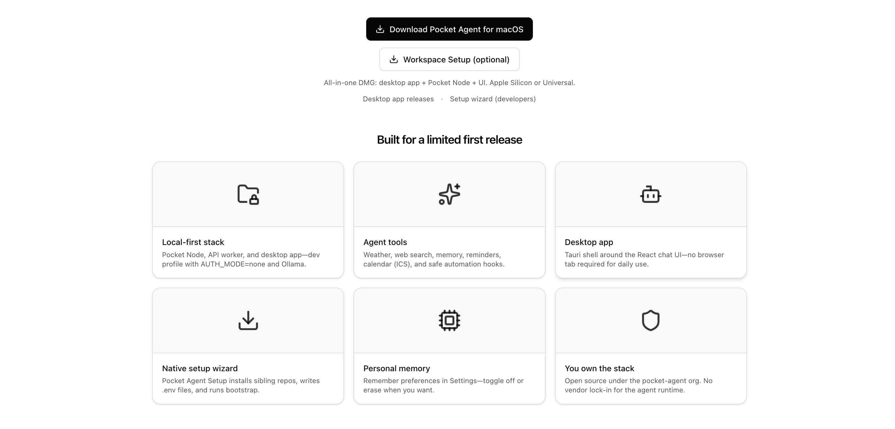

<div>
<h3>pocket-agent-app</h3>
<p>
<strong>Pocket Agent fullstack app</strong> — React dashboard and Hono API on <strong>Cloudflare Workers</strong> in one monorepo. Google OAuth (or local bypass) on the worker; chat and settings proxied to Pocket Node.
</p>
<a href="https://pocket-agent.pages.dev/"></a>
</div>

<br/><br/>

<div align="center">

[](https://github.com/pocket-agent/pocket-agent-app/actions/workflows/ci.yml)
[](https://github.com/pocket-agent/pocket-agent-app/blob/main/LICENSE)
[](https://github.com/pocket-agent/pocket-agent-app)
[](https://workers.cloudflare.com/)

<br/>
<br/>

<br/>

**Chat · Monitor · Settings · OAuth**

</div>

<hr>

## Layout

Same pattern as [dropafile](https://github.com/dropafile/dropafile) — one Vite dev server, worker-first API routes, SPA assets.

```text
src/
├── api-server/   # Hono Cloudflare Worker (auth, /chat, /me, /health)
└── app/          # React SPA (dashboard UI)
index.html        → /src/app/main.tsx
wrangler.toml     → main = src/api-server/index.ts
```

| Layer | Tech |
|-------|------|
| **Edge API** | Hono · Google JWT · proxy to Pocket Node |
| **Web app** | React · Vite · shadcn/ui |
| **Contracts** | [`pocket-agent-sdk`](../pocket-agent-sdk) |

## Prerequisites

- [Bun](https://bun.sh) or Node 20+
- Pocket Node running at `http://127.0.0.1:8787` ([`pocket-agent`](../pocket-agent))

## Quick start

```bash
git clone https://github.com/pocket-agent/pocket-agent-app.git
cd pocket-agent-app
cp .env.example .env.local
cp .dev.vars.example .dev.vars
bun install
bun run dev
```

Open **http://localhost:5173** — UI and API share the same origin (`/health`, `/chat`, …).

Terminal 1 (Pocket Node):

```bash
cd ../pocket-agent && source .venv/bin/activate && pocket-agent serve
```

## Scripts

| Command | Description |
|---------|-------------|
| `bun run dev` | Vite + Cloudflare worker (port 5173) |
| `bun run build` | Production SPA + worker bundle |
| `bun run deploy` | Build and `wrangler deploy` |
| `bun run typecheck` | TypeScript check (app + worker) |

## Environment

| File | Purpose |
|------|---------|
| `.env.local` | Vite — `VITE_AUTH_MODE`, `VITE_GOOGLE_CLIENT_ID` |
| `.dev.vars` | Wrangler — `AUTH_MODE`, `GOOGLE_CLIENT_ID`, `POCKET_NODE_URL` |

All-local dev uses `AUTH_MODE=none` (no Google sign-in). Set `POCKET_NODE_URL=http://127.0.0.1:8787`.

## Deploy

See [docs/DEPLOYMENT.md](docs/DEPLOYMENT.md). Set production secrets:

```bash
wrangler secret put GOOGLE_CLIENT_ID --env production
wrangler secret put POCKET_NODE_URL --env production
wrangler secret put ALLOWED_ORIGINS --env production
```

## Related repos

| Repo | Role |
|------|------|
| [pocket-agent](https://github.com/pocket-agent/pocket-agent) | Pocket Node (Python) |
| [pocket-agent-sdk](https://github.com/pocket-agent/pocket-agent-sdk) | Shared contracts |
| [pocket-agent-wizard](https://github.com/pocket-agent/pocket-agent-wizard) | Workspace setup UI |

> **Note:** `pocket-agent-web-app` and `pocket-agent-api-app` were merged into this repo.
